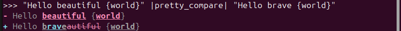

# pretty_prompt_compare

A python package for comparing prompts with pretty print.

## Installation

```bash
pip install pretty_prompt_compare
```

## Usage

```python
from pretty_prompt_compare import PrettyCompare

pretty_compare = PrettyCompare(compare_response=True, target=["brave", "beautiful", "world"])

# pretty_compare = PrettyCompare(compare_response=True, print_separator=True)
"Hello beautiful {world}" |pretty_compare| "Hello brave {world}"
```
