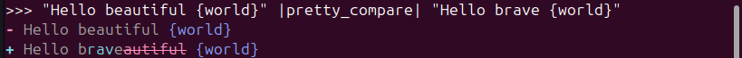
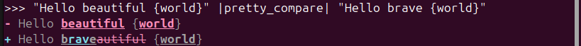

# pretty_prompt_compare

A python package for comparing prompts/responses with pretty print.


In the age of LLMs, a lot of prompt engineering comes down to comparing prompts and their responses. This Python package helps by pretty-printing prompts and responses, making it easier to see differences and embed this workflow into your Python development environment.

## Installation

```bash
pip install pretty_prompt_compare
```

## Usage

```python
from pretty_prompt_compare import PrettyCompare

# to compare differences in prompts
pretty_compare = PrettyCompare(compare_prompt=True)
"Hello beautiful {world}" |pretty_compare| "Hello brave {world}"
```


```python
from pretty_prompt_compare import PrettyCompare

# to compare differences in responses
pretty_compare = PrettyCompare(compare_response=True, target=["brave", "beautiful", "world"])
"Hello beautiful {world}" |pretty_compare| "Hello brave {world}"
```


## License

MIT License

